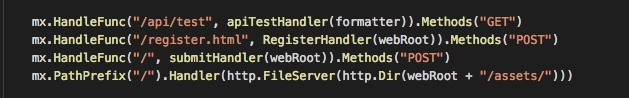
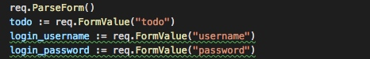
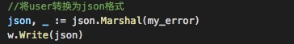
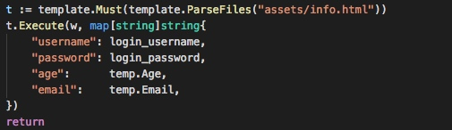
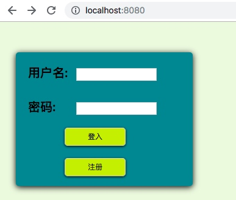
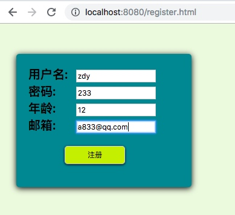
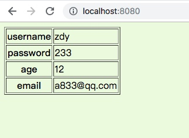
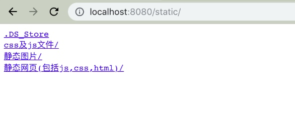
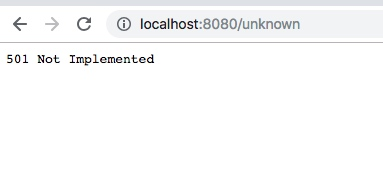

<!-- TOC -->

<h1>简单的web服务器</h1>
这是一个简单的输出hello world！的web服务器，只用在客户端访问 http://localhost:9090/ 就可以获得响应内容。
```go
package main

import (
    "fmt"
    "net/http"
    "strings"
    "log"
)

func sayhelloName(w http.ResponseWriter, r *http.Request) {
    w.Write([]byte("Hello World!"))
}

func main() {
    http.HandleFunc("/", sayhelloName)       //设置访问的路由
    err := http.ListenAndServe(":9090", nil) //设置监听的端口
    if err != nil {
        log.Fatal("ListenAndServe: ", err)
    }
}
```

这段代码很简单，就主要是是用了两个函数，首先调用http.HandleFunc()设置路由和响应处理函数，然后用http.ListenAndServe()去监听端口，就好了。

<h2>HandleFunc()分析</h2>

http.HandleFunc()的定义，用来使用对应的函数。

```go
// HandleFunc registers the handler function for the given pattern.
func (mux *ServeMux) HandleFunc(pattern string, handler func(ResponseWriter, *Request)) {
	mux.Handle(pattern, HandlerFunc(handler))
}
```

可以看出来上面就是用来mux.Handle函数，Http包默认的路由器：DefaultServeMux, 它的ServeMux的结构看起来好像很简单。</br>
上述代码中，实现了Handler接口的ServeHTTP方法。使用HandlerFunc类型包装一下路由定义的indexHandler函数，其目的就是为了让这个函数也实现ServeHTTP方法，即转变成一个handler处理器(函数)。

```go
type ServeMux struct {
    mu    sync.RWMutex
    m     map[string]muxEntry
    hosts bool 
}
type muxEntry struct {
    explicit bool
    h        Handler
    pattern  string
}
```

ServeMux里最重要的应该就是m了，这个map的key是一些url模式，value是一个muxEntry结构，后者里定义存储了具体的url模式和handler。</br>
根据HandleFunc的输入就可以，开始调用mux.Handle函数了。

```go
// Handle registers the handler for the given pattern.
// If a handler already exists for pattern, Handle panics.
func (mux *ServeMux) Handle(pattern string, handler Handler) {
	mux.mu.Lock()
	defer mux.mu.Unlock()

	if pattern == "" {
	   if pattern == "" {
        panic("http: invalid pattern " + pattern)
    }
    if handler == nil {
        panic("http: nil handler")
    }
    if mux.m[pattern].explicit {
        panic("http: multiple registrations for " + pattern)
    }

    if mux.m == nil {
        mux.m = make(map[string]muxEntry)
    }
    mux.m[pattern] = muxEntry{explicit: true, h: handler, pattern: pattern}

    if pattern[0] != '/' {
        mux.hosts = true
    }

    n := len(pattern)
    if n > 0 && pattern[n-1] == '/' && !mux.m[pattern[0:n-1]].explicit {

        path := pattern
        if pattern[0] != '/' {
            path = pattern[strings.Index(pattern, "/"):]
        }
        url := &url.URL{Path: path}
        mux.m[pattern[0:n-1]] = muxEntry{h: RedirectHandler(url.String(), StatusMovedPermanently), pattern: pattern}
    }
}
```

由此可见，Handle函数的主要目的在于把handler和pattern模式绑定到map[string]muxEntry的map上，其中muxEntry保存了更多pattern和handler的信息，

<h2>ListenAndServe()分析</h2>

```go
func ListenAndServe(addr string, handler Handler) error {
	server := &Server{Addr: addr, Handler: handler}
	return server.ListenAndServe()
}
```

先实例化一个Server对象，然后调用 (Server) ListenAndServe()方法进行监听：

```go
func (srv *Server) ListenAndServe() error {
	addr := srv.Addr
	if addr == "" {
		addr = ":http"
	}
	ln, err := net.Listen("tcp", addr)    //监听端口
	if err != nil {
		return err
	}
	return srv.Serve(tcpKeepAliveListener{ln.(*net.TCPListener)})
}
```

函数 srv.Serve()函数启动一个for循环，然后在循环体中Accept请求，对每个请求实例化一个Conn，并且开启一个goroutine为这个请求进行服务go c.serve()。

```go
func (srv *Server) Serve(l net.Listener) error {
	defer l.Close()
	var tempDelay time.Duration // how long to sleep on accept failure
	for {
		rw, e := l.Accept() //通过Listener接收请求
		if e != nil {
			if ne, ok := e.(net.Error); ok && ne.Temporary() {
				if tempDelay == 0 {
					tempDelay = 5 * time.Millisecond
				} else {
					tempDelay *= 2
				}
				if max := 1 * time.Second; tempDelay > max {
					tempDelay = max
				}
				log.Printf("http: Accept error: %v; retrying in %v", e, tempDelay)
				time.Sleep(tempDelay)
				continue
			}
			return e
		}
		tempDelay = 0
		c, err := srv.newConn(rw) //创建一个Conn。Conn是net包里面的一个接口 type Conn interface。Conn接口代表通用的面向流的网络连接。多个线程可能会同时调用同一个Conn的方法。
		if err != nil {
			continue
		}
		go c.serve() //Go语言高并发的体现
	}
}
```


<h1>搭建一个web服务器</h1>

一个简单的服务器，所以就没有使用牛逼的框架，就用了老师给的 "github.com/codegangsta/negroni"、"github.com/gorilla/mux"、"github.com/unrolled/render" 这三个。

<h2>Server注册路由</h2>

----

用HandleFunc给每种访问提供对应的处理路由。</br>


<h2>表单处理</h2>

----

通过PaeseForm，提取表单内部的数据值。</br>



<h2>处理完回应</h2>

----

将你的数据转化成页面写上去。</br>




<h2>实现效果</h2>

----

登入</br>


注册，传表单</br>



登入查看对应内容</br>




静态文件服务</br>



/unknown</br>




