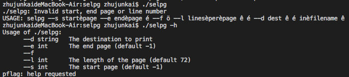
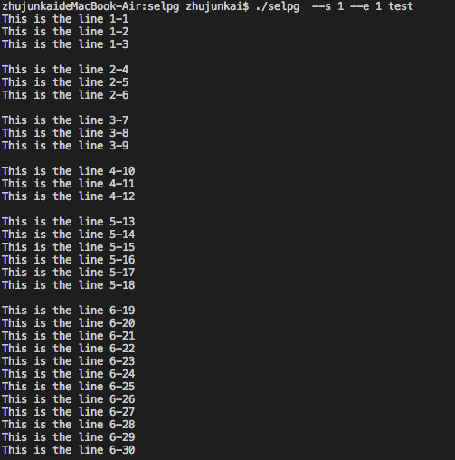
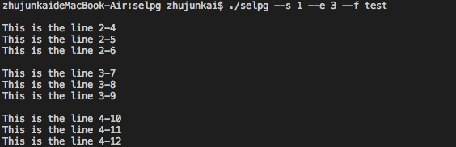
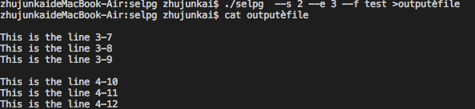
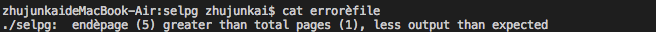

#Go的Selpg

-----

[TOC]

##使用方法

```USAGE: ./selpg --s start_page --e end_page [ --f | --l lines_per_page ] [ --d dest ] [ in_filename ]```

##参考资料

这个主要就是根据[c语言版本的selpg](./selpg.c)进行翻译得到的对应的go语言selpg。（借助老师提供那些网址帮助翻译，并且使用pflag来获取参数）

##代码内容

* ```type selpg_args struct``` 这个是记录参数的函数
* ```main()``` 函数本来是只包含了一些初始化和其他模块的引用，但后来发现Pflag没有那么复杂，就也放在里面了
* ```Usage()``` 输入格式的提示函数
* ```validate_args(sa selpg_args, rest int)``` 用于检验输入参数是否合理的函数
* ```process_input()``` 函数是为了根据参数的设置对输入进行相应的输出
* ```process_args(args []string)``` 这是根据c版本的改编的一个函数，已经被上面的pflag代替，没有用到，主要是用来检测参数输入用的。

##运行截图

###程序提示

```./selpg -h```



###测试

```./selpg --s 1 --e 3 test```



```./selpg --s 1 --e 3 --f test```



```./selpg  --s 2 --e 3 --f test >output_file```

```cat output_file```



```./selpg  --s 1 --e 5 test 2>error_file```

```cat error_file```



